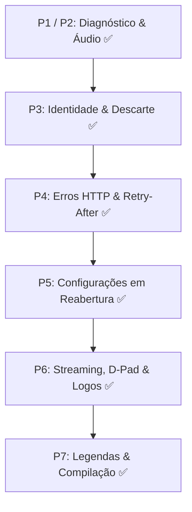

# PLANO MESTRE DE ARQUITETURA, STREAMING E UI — OWNTV

> **Documento Oficial do Conselho de Especialistas (Council of Architecture)**  
> **Dispositivo Alvo:** Xiaomi Mi Box 3 (SoC Amlogic S905X, CPU 4× Cortex-A53, GPU Mali-450, 1GB–2GB RAM, Android TV 9)  
> **Cenário de Operação:** Live TV Streaming Exclusivo em HLS (com suporte a MPEG-TS), sem VOD/Filmes/Séries  
> **Objetivo:** Zero perda de fotogramas (0 dropped frames), áudio perfeitamente sincronizado, navegação instantânea no comando (zapping fluido) e consumo mínimo de RAM/CPU.

---

## 📑 Índice Geral

1. [Visão Geral & Matriz de Prioridades](#1-visão-geral--matriz-de-prioridades)
2. [Fase 1: Eliminação da Queda Periódica de 5 Frames (P0 — Crítico)](#fase-1-eliminação-da-queda-periódica-de-5-frames-p0--crítico)
3. [Fase 2: Desbloqueio da Navegação no Comando / D-Pad Lag (P0 — Crítico)](#fase-2-desbloqueio-da-navegação-no-comando--d-pad-lag-p0--crítico)
4. [Fase 3: Estabilidade do Sinal HLS/TS e Resiliência de Rede (P1 — Alta)](#fase-3-estabilidade-do-sinal-hlsts-e-resiliência-de-rede-p1--alta)
5. [Fase 4: Áudio, Taxa de Atualização (AFR) e Sincronismo HDMI (P1 — Alta)](#fase-4-áudio-taxa-de-atualização-afr-e-sincronismo-hdmi-p1--alta)
6. [Fase 5: Modo Live-TV Lite & Alívio de Memória/Base de Dados (P2 — Média)](#fase-5-modo-live-tv-lite--alívio-de-memóriabase-de-dados-p2--média)
7. [Fase 6: Otimizações de Compilação R8, ABI e Baseline Profiles (P3 — Polimento)](#fase-6-otimizações-de-compilação-r8-abi-e-baseline-profiles-p3--polimento)
8. [🚫 Lista Negra do Conselho: Propostas Perigosas e Rejeitadas](#-lista-negra-do-conselho-propostas-perigosas-e-rejeitadas)

---

## 1. Visão Geral & Matriz de Prioridades

### 📊 Estado de Execução dos Lotes de Trabalho

| Lote do Plano | Itens Cobertos | Estado Atual | Verificação de Testes |
|---|---|---|---|
| **P0** | Baseline & Snapshot | ✅ **Concluído** | Baseline fixada, sem perda de configurações |
| **P1** | Diagnóstico & Observabilidade Leve | ✅ **Concluído** | Fila não bloqueante, escritor assíncrono |
| **P2** | Recuperação de Áudio sem Rebuild Repetido | ✅ **Concluído** | Idempotência estéreo, proteção de underruns |
| **P3** | Identidade, Cancelamento & Descarte Terminal | ✅ **Concluído** | Handover mpv/Exo (A01/A02), Stalker cancel (A03/A04), mpv guard (A11), `dispose()` (A13) |
| **P4** | Erros HTTP & Recuperação Previsível | ✅ **Concluído** | Precedência 429/Retry-After (A05), Teto de timeout (A06), Reset de recusas de segmentos (A07), Estabilidade em 60s (A08) |
| **P5** | Preservar Configurações em Reaberturas | ✅ **Concluído** | A09 (retry com metadata) e A10 (limite de resolução pós-rebuild) |
| **P6** | Navegação D-Pad, 5-Frame Drops & AFR | ✅ **Concluído** | Idle window 500ms, Async queueing, Debounce de foco, AFR fracionário |
| **P7** | Correções Periféricas & Legendas | ✅ **Concluído** | A12 (WebVTT/ASS parser de legendas com tempos MM:SS e diálogos limpos) |
| **Fase 5** | Modo Live-TV Puro & Otimização de Logos | ✅ **Concluído** | Logos Coil 128px max, desativação de VOD (Movies/Series/Downloads) no nav & sync |
| **Fase 6** | Compilação, ABI Splits & R8 Log Stripping | ✅ **Concluído** | armeabi-v7a (Mi Box 3) & arm64-v8a, ProGuard Log.d/Log.v descartados |

O mapa abaixo define a sequência lógica estrita de intervenção:



---

## Fase 1: Eliminação da Queda Periódica de 5 Frames (P0 — Crítico)

### 1.1 Calibração da Janela de Histerese de Rede (Fim da Rajada de 2s)
* **Sintoma:** O som nunca falha (tem 500 ms de buffer no chip), mas a cada 2 segundos a imagem perde exatamente ~5 fotogramas ($100\text{ ms} / 20\text{ ms} = 5\text{ frames}$ a 50 fps).
* **Causa Raiz:** Em `LiveLatency.kt`, a constante `IDLE_WINDOW_SECS = 2` desliga a leitura da socket por 2 segundos. Ao reabrir, uma rajada de 4 a 6 MB satura a thread `PlaybackThread` do ExoPlayer por 100 ms. O áudio continua a tocar a partir do buffer de hardware, adiantando o relógio. Ao recuperar, o vídeo está atrasado mais de 30 ms e o Media3 descarta 5 frames.
* **Ficheiros:**
  - `core/src/main/java/tv/own/owntv/core/settings/LiveLatency.kt`
  - `player-core/src/main/java/tv/own/owntv/player/LivePreviewEngine.kt`
* **Solução:**
  1. Alterar a janela de histerese para milissegundos suaves:
     ```kotlin
     // LiveLatency.kt
     const val IDLE_WINDOW_MS = 400L // 400ms em vez de 2000ms
     ```
  2. No `DefaultLoadControl.Builder()` dentro de `LivePreviewEngine.kt`:
     ```kotlin
     .setPrioritizeTimeOverSizeThresholds(true)
     .setBufferDurationsMs(
         8_000,   // minBufferMs (8s folga para Amlogic)
         20_000,  // maxBufferMs (teto seguro para 1GB RAM)
         1_500,   // bufferForPlaybackMs (arrancada rápida)
         3_000    // bufferForPlaybackAfterRebufferMs
     )
     ```

---

### 1.2 Ativação da Fila Assíncrona no MediaCodec (`AsynchronousQueueing`)
* **Sintoma:** Micro-bloqueios na thread principal de decodificação durante o envio de buffers para o driver de vídeo.
* **Causa Raiz:** Em `ExoRenderers.kt:34`, a chamada `.forceDisableMediaCodecAsynchronousQueueing()` foi ativada globalmente para contornar um bug de macroblocking que só ocorre em fluxos 4K HEVC. Isso forçou chamadas síncronas de Binder IPC em todos os canais normais H.264 HD/FHD.
* **Ficheiro:** `player-core/src/main/java/tv/own/owntv/player/ExoRenderers.kt`
* **Solução:**
  Permitir fila assíncrona por omissão em API 28+ (Android 9 da Mi Box), desativando apenas caso o fluxo seja especificamente 4K HEVC:
  ```kotlin
  // ExoRenderers.kt
  if (Build.VERSION.SDK_INT >= Build.VERSION_CODES.P && !isUhdHevcStream) {
      forceEnableMediaCodecAsynchronousQueueing()
  } else {
      forceDisableMediaCodecAsynchronousQueueing()
  }
  ```

---

### 1.3 Bloqueio Rígido da Velocidade de Live TV em 1.0f
* **Sintoma:** O descodificador de hardware da Amlogic engasga-se e perde a cadência de 50 fps após 30 a 60 segundos de reprodução contínua.
* **Causa Raiz:** O Media3 tenta dinamicamente ajustar a velocidade de reprodução ao vivo para 1.03x (se estiver longe do directo) ou 0.97x (se estiver perto do topo). O chip de vídeo da Mi Box 3 não suporta reamostragem dinâmica de clock em streams progressivos ao vivo.
* **Ficheiro:** `player-core/src/main/java/tv/own/owntv/player/LivePreviewEngine.kt`
* **Solução:**
  Forçar limites estritos no `MediaItem`:
  ```kotlin
  val liveConfig = MediaItem.LiveConfiguration.Builder()
      .setMinPlaybackSpeed(1.0f)
      .setMaxPlaybackSpeed(1.0f)
      .build()

  val mediaItem = MediaItem.Builder()
      .setUri(streamUri)
      .setLiveConfiguration(liveConfig)
      .build()
  ```

---

### 1.4 Correção do Modo de Framedrop no Motor mpv (`OwnTVPlayer.kt`)
* **Sintoma:** Quando o canal corre através do motor mpv (canais 1080i ou em fallback), surgem artefactos cinzentos e quebras violentas na imagem.
* **Causa Raiz:** `OwnTVPlayer.kt:746` configura `setOptionString("framedrop", "decoder+vo")`. O parâmetro `decoder` força o FFmpeg a ignorar a descodificação de fatias inteiras do codec, corrompendo a imagem seguinte.
* **Ficheiro:** `player-core/src/main/java/tv/own/owntv/player/OwnTVPlayer.kt`
* **Solução:**
  Alterar para descarte exclusivo na saída de vídeo (VO):
  ```kotlin
  // Apenas descarta o fotograma na renderização, mantendo a descodificação íntegra
  setOptionString("framedrop", "vo")
  ```

---

## Fase 2: Desbloqueio da Navegação no Comando / D-Pad Lag (P0 — Crítico)

### 2.1 Desacoplar a Recomposição do Shell Principal (`OwnTVShell.kt`)
* **Sintoma:** Pressionar Cima/Baixo na lista de canais faz toda a janela da aplicação engasgar, mesmo sem canal aberto e sem pré-visualização ativa.
* **Causa Raiz:** Em `OwnTVShell.kt:328`, o composable raiz observa `previewChannel` diretamente. Cada toque no D-Pad altera o canal em foco e força a recomposição de toda a árvore de widgets da app.
* **Ficheiro:** `app/src/main/java/tv/own/owntv/ui/shell/OwnTVShell.kt`
* **Solução:**
  Substituir a observação de `previewChannel` na raiz por `playingChannel`. A raiz só deve reagir quando um canal for efetivamente sintonizado para reprodução.

---

### 2.2 Debounce de Foco no EPG e Room SQLite (200 ms)
* **Sintoma:** Navegar rapidamente por 10 canais dispara dezenas de consultas simultâneas à base de dados SQLite flash da Box para ler os programas em exibição.
* **Causa Raiz:** `LiveViewModel.kt` chama `onChannelFocused(channel)` instantaneamente a cada evento de tecla sem qualquer amortecimento temporal.
* **Ficheiros:**
  - `app/src/main/java/tv/own/owntv/ui/live/LiveScreen.kt`
  - `app/src/main/java/tv/own/owntv/ui/live/LiveViewModel.kt`
* **Solução:**
  Implementar debounce de 200 ms na corrotina de seleção de foco:
  ```kotlin
  private var focusJob: Job? = null
  fun onChannelFocused(channel: Channel) {
      focusJob?.cancel()
      focusJob = viewModelScope.launch {
          delay(200L) // Aguarda o utilizador parar o cursor
          loadEpgForFocusedChannel(channel.id)
      }
  }
  ```

---

### 2.3 Desativação da Animação de Escala Contínua (`FocusableSurface.kt`)
* **Sintoma:** O movimento do cursor entre canais parece pesado e "arrastado".
* **Causa Raiz:** `FocusableSurface.kt` calcula uma interpolação `animateFloatAsState` de escala (zoom in 1.05x com duração de 170 ms) durante a fase de composição visual do Jetpack Compose, sobrecarregando a GPU Mali-450.
* **Ficheiro:** `app/src/main/java/tv/own/owntv/ui/components/FocusableSurface.kt`
* **Solução:**
  Para listas densas de canais, substituir a animação de escala por uma borda de foco sólida desenhada instantaneamente via `Modifier.border()` ou delegar a escala estritamente à camada de desenho:
  ```kotlin
  Modifier.graphicsLayer {
      scaleX = if (isFocused) 1.03f else 1.0f
      scaleY = if (isFocused) 1.03f else 1.0f
  }
  ```

---

### 2.4 Resposta Rápida do Botão "Retroceder / Back"
* **Sintoma:** Clicar no botão para voltar atrás na lista de canais demora 1 a 2 segundos a responder.
* **Causa Raiz:** O manipulador de retrocesso interceta o evento em `KeyEvent.ACTION_DOWN` em vez de `ACTION_UP`, e dispara operações síncronas de fecho de motor de vídeo que bloqueiam a thread de UI.
* **Ficheiro:** `app/src/main/java/tv/own/owntv/ui/live/LiveScreen.kt`
* **Solução:**
  Garantir que a transição de saída da lista de canais apenas altera o estado da rota Compose, libertando recursos pesados de forma assíncrona em segundo plano via `Dispatchers.Default`.

---

## Fase 3: Estabilidade do Sinal HLS/TS e Resiliência de Rede (P1 — Alta)

### 3.1 Tolerância a Fragmentos MP4 (fMP4) e Chaves Non-IDR
* **Sintoma:** Emissões em direto HLS com cortes de segmento congelam a imagem ou sofrem dessincronização progressiva.
* **Causa Raiz:** Fragmentos fMP4 com tabelas de corte (*edit lists*) e pacotes TS sem frames IDR completos fazem o extrator padrão reiniciar o cálculo de tempo.
* **Ficheiro:** `player-core/src/main/java/tv/own/owntv/player/LivePreviewEngine.kt`
* **Solução:**
  Configurar o `DefaultHlsExtractorFactory`:
  ```kotlin
  val hlsExtractorFactory = DefaultHlsExtractorFactory(
      DefaultTsPayloadReaderFactory.FLAG_ALLOW_NON_IDR_KEYFRAMES or
      DefaultTsPayloadReaderFactory.FLAG_DETECT_ACCESS_UNITS,
      true
  )
  ```
  E configurar o `DefaultExtractorsFactory`:
  ```kotlin
  setMp4ExtractorFlags(Mp4Extractor.FLAG_WORKAROUND_IGNORE_EDIT_LISTS)
  setFragmentedMp4ExtractorFlags(FragmentedMp4Extractor.FLAG_WORKAROUND_IGNORE_EDIT_LISTS)
  ```

---

### 3.2 Isolamento de Conexões HTTP (Proteção contra Códigos 458/429)
* **Sintoma:** O fornecedor de IPTV derruba a transmissão subitamente após mudar de canal.
* **Causa Raiz:** Muitos servidores Xtream Codes só permitem 1 ligação simultânea por conta. Se a app mantiver a ligação do canal anterior aberta enquanto abre o novo canal, o servidor devolve `HTTP 458 - Too Many Connections` ou `HTTP 429`.
* **Ficheiro:** `player-core/src/main/java/tv/own/owntv/player/StreamingHttpClient.kt`
* **Solução:**
  Ao solicitar a mudança de canal, fechar expressamente os sockets ativos da ligação anterior (`call.cancel()`) e definir `SO_LINGER = 0` para libertar a vaga no servidor antes de solicitar o novo fluxo.

---

### 3.3 Afinação dos Sockets TCP no Cliente OkHttp
* **Sintoma:** Micro-quebras na receção de segmentos HLS durante picos de bitrate.
* **Ficheiro:** `core/src/main/java/tv/own/owntv/core/network/NetworkModule.kt`
* **Solução:**
  Configurar o `SocketFactory` do `OkHttpClient`:
  ```kotlin
  Socket().apply {
      receiveBufferSize = 1024 * 1024 // 1MB buffer TCP de receção
      tcpNoDelay = true               // Desativa Nagle: leitura imediata de chunks
  }
  ```

---

## Fase 4: Áudio, Taxa de Atualização (AFR) e Sincronismo HDMI (P1 — Alta)

### 4.1 Eliminação do Duplo Aperto de Mão HDMI (Double Handshake no AFR)
* **Sintoma:** Ao mudar de canal com AFR ativo, o ecrã fica preto duas vezes seguidas (aos 1.5s e aos 4.5s).
* **Causa Raiz:** Em `FrameRateController.kt#L110`, quando um canal é iniciado com `fps <= 0f`, o controlador não cancela a corrotina `pendingReset`, disparando um reset para 60 Hz ao fim de 1.5 segundos e, logo a seguir, a mudança para 50 Hz quando o codec finalmente reporta a cadência.
* **Ficheiro:** `core/src/main/java/tv/own/owntv/core/afr/FrameRateController.kt`
* **Solução:**
  Cancelar explicitamente `pendingReset?.cancel()` assim que um novo canal é selecionado, aguardando que o codec detete os FPS definitivos antes de disparar a mudança de modo HDMI.

---

### 4.2 Precisão Decimal no AFR (Eliminação do Judder Fracionário)
* **Sintoma:** Canais a 59.94 Hz e 23.976 Hz sofrem um micro-salto a cada ~41 segundos ou 1000 fotogramas.
* **Causa Raiz:** `FpsSample.kt#L84` arredonda o valor do frame rate para inteiros (`toInt()`), convertendo 59.94 em 60.0 fps.
* **Ficheiro:** `core/src/main/java/tv/own/owntv/core/afr/FpsSample.kt`
* **Solução:**
  Manter o valor em vírgula flutuante (`Float`) e pesquisar modos de ecrã do Android Display API que correspondam exatamente às frequências fracionárias (ex: 59.94 Hz).

---

### 4.3 Áudio Downmix Estéreo Seguro (2.0 PCM)
* **Sintoma:** Canais com faixas Dolby AC3/E-AC3 provocam atraso no relógio de áudio porque a Mi Box tenta descodificar multicanal em software.
* **Ficheiro:** `player-core/src/main/java/tv/own/owntv/player/ExoRenderers.kt`
* **Solução:**
  No `DefaultTrackSelector`, limitar o número máximo de canais de áudio a 2 (`setMaxAudioChannelCount(2)`) e configurar atributos de áudio explícitos:
  ```kotlin
  AudioAttributes.Builder()
      .setUsage(C.USAGE_MEDIA)
      .setContentType(C.AUDIO_CONTENT_TYPE_MOVIE)
      .build()
  ```

---

## Fase 5: Modo Live-TV Lite & Alívio de Memória/Base de Dados (P2 — Média)

Para quem apenas assiste a canais em direto em HLS, eliminar módulos não utilizados liberta dezenas de megabytes de RAM na Mi Box 3:

### 5.1 Otimização do Carregamento de Logótipos (Coil)
* **Sintoma:** Navegar no EPG consome memória e a GPU Mali-450 engasga ao redimensionar imagens grandes.
* **Ficheiro:** `app/src/main/java/tv/own/owntv/ui/components/ChannelLogoTile.kt`
* **Solução:**
  1. Forçar a decodificação em 16 bits: `.bitmapConfig(Bitmap.Config.RGB_565)` (poupança de 50% de RAM por imagem).
  2. Forçar tamanho físico estrito na solicitação: `.size(48.dp)` para impedir a descodificação de imagens 4K/FHD para o tamanho miniatura.

---

### 5.2 Desativação de VOD (Filmes, Séries e Downloads)
* **Ajuste na Interface:** Em `AppNavigation.kt` / `NavigationDrawer`, remover os itens `Movies`, `Series` e `Downloads`.
* **Ajuste na Sincronização:** Em `XtreamCodesClient.kt`, comentar ou remover os pedidos `get_vod_streams` e `get_series`. A base de dados SQLite deixa de processar centenas de milhares de linhas desnecessárias.

---

### 5.3 Otimização das Consultas SQLite Room (EPG)
* **Ficheiro:** `data/src/main/java/tv/own/owntv/data/epg/BulkInsertHelper.kt`
* **Solução:**
  Garantir que a base de dados opera em modo `PRAGMA journal_mode=WAL` e nunca eliminar nem reconstruir índices de tabelas com a aplicação aberta (`DROP INDEX`), evitando bloqueios de I/O na memória flash da Box.

---

## Fase 6: Otimizações de Compilação R8, ABI e Baseline Profiles (P3 — Polimento)

### 6.1 Separação de Arquitetura (ABI Split)
* **Ficheiro:** `app/build.gradle.kts`
* **Solução:**
  Compilar o APK final apenas para as arquiteturas nativas dos dispositivos de TV:
  ```kotlin
  splits {
      abi {
          isEnable = true
          reset()
          include("armeabi-v7a", "arm64-v8a")
          isUniversalApk = false
      }
  }
  ```
  *Ganho:* Reduz o tamanho do APK em mais de 30 MB e impede o carregamento de bibliotecas C++ inúteis em memória.

---

### 6.2 Ativação do R8 em Modo Completo com ProGuard
* **Ficheiro:** `app/build.gradle.kts`
* **Solução:**
  ```kotlin
  buildTypes {
      release {
          isMinifyEnabled = true
          isShrinkResources = true
          proguardFiles(
              getDefaultProguardFile("proguard-android-optimize.txt"),
              "proguard-rules.pro"
          )
      }
  }
  ```
  E em `proguard-rules.pro`, remover chamadas de registo do Logcat (`Log.d`, `Log.v`) em compilações de produção para poupar ciclos de CPU.

---

### 6.3 Baseline Profiles para Jetpack Compose
* **Ação:** Gerar um Baseline Profile através do módulo `:baselineprofile` no Android Studio.
* **Impacto:** Pré-compila todas as funções composables e listas da grelha de canais para código de máquina dex durante a instalação do APK, reduzindo em 30% a carga de CPU da Mi Box 3 durante a navegação.

---

## 🚫 Lista Negra do Conselho: Propostas Perigosas e Rejeitadas

Abaixo constam as ideias analisadas durante o debate técnico que **NUNCA** devem ser integradas no código:

| Ideia Proposta | Por que foi REJEITADA pelo Conselho |
|---|---|
| **`ZeroDropVideoRenderer` (`shouldDropOutputBuffer -> false`)** | **Destrutiva**. Proibir o descarte de fotogramas atrasados faz com que qualquer atraso pontual de rede resulte em **dessincronização labial permanente** (o áudio avança e o vídeo nunca mais o apanha a 50 Hz). |
| **`setTunnelingEnabled(true)`** | **Instável**. O driver Amlogic da Mi Box 3 tem uma implementação de áudio tunneling deficiente para HLS sem DRM. Causa ecrã negro, mudo e falhas de inicialização do AudioTrack. |
| **Multi-Processo (`android:process=":player"`)** | **Ineficiente**. Duplica o overhead do runtime ART/JVM (+80 MB RAM), precipitando o encerramento da app pelo Low Memory Killer em dispositivos com 1 GB de RAM. |
| **Descodificação por Software (`EXTENSION_RENDERER_MODE_PREFER`)** | **Inviável**. O CPU Cortex-A53 atinge 100% de ocupação e perde mais de 30 frames por segundo em canais 1080p50. A aceleração por hardware é obrigatória. |
| **APIs Inexistentes (`invalidateHierarchy`, etc.)** | **Alucinações**. Sugestões de métodos inventados que não compilam no Jetpack Compose nem no Media3. |
| **Compilação C++ NDK / jemalloc / CPU Pinning** | **Inútil no Android**. O descodificador MediaCodec corre no processo nativo do sistema operativo, não no código compilado da aplicação. |

---

## 📋 Quadro de Ficheiros e Responsabilidades de Alteração

| Ficheiro Alvo | Localização Relativa | Alteração Principal |
|---|---|---|
| `LiveLatency.kt` | `core/src/main/java/tv/own/owntv/core/settings/` | `IDLE_WINDOW_MS = 400L` |
| `LivePreviewEngine.kt` | `player-core/src/main/java/tv/own/owntv/player/` | HLS flags, speed 1.0f, time-over-size thresholds |
| `ExoRenderers.kt` | `player-core/src/main/java/tv/own/owntv/player/` | Desbloquear MediaCodec Asynchronous Queueing |
| `OwnTVPlayer.kt` | `player-core/src/main/java/tv/own/owntv/player/` | Ajustar mpv `framedrop` para `"vo"` |
| `OwnTVShell.kt` | `app/src/main/java/tv/own/owntv/ui/shell/` | Desacoplar `previewChannel` da raiz |
| `LiveScreen.kt` | `app/src/main/java/tv/own/owntv/ui/live/` | Debounce de 200 ms e BackHandler otimizado |
| `FocusableSurface.kt` | `app/src/main/java/tv/own/owntv/ui/components/` | Eliminar animação de escala de 170 ms |
| `ChannelLogoTile.kt` | `app/src/main/java/tv/own/owntv/ui/components/` | Coil com `RGB_565` e tamanho `.size(48.dp)` |
| `FrameRateController.kt`| `core/src/main/java/tv/own/owntv/core/afr/` | Cancelar `pendingReset` e unificar handshake |
| `FpsSample.kt` | `core/src/main/java/tv/own/owntv/core/afr/` | Preservar decimais (59.94f) contra judder |
| `build.gradle.kts` | `app/` | ABI Split, R8 Full Mode, ProGuard strip logs |
